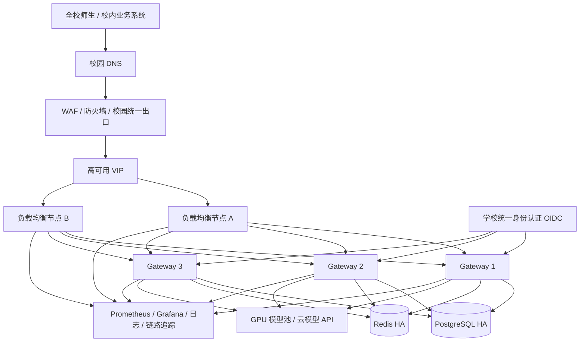

# AI Gateway 全校级分布式部署方案

> 文档版本：1.0  
> 编制日期：2026-09-18  
> 适用项目：`ai-gateway-standalone` 2.6.11  
> 文档状态：生产部署设计稿；容量数字需在压测后定版

## 1. 建设目标

本方案用于将 AI Gateway 建设为面向全校师生和校内业务系统的统一 AI 服务入口，目标包括：

- 网关节点故障时服务不中断；
- 支持 Chat、Embedding、Rerank、语音、图片和视频等多种模型能力；
- 统一接入校级身份认证，区分管理员、教师、学生和业务系统；
- 实现按用户、角色、院系、模型和业务系统的访问控制、配额及审计；
- 支持流式输出、长连接和异步视频任务；
- 数据库、缓存、配置、日志和监控均具备生产级持久化与恢复能力；
- 支持滚动升级、横向扩容和故障回退。

本方案只规划网关及其公共基础设施。GPU 推理服务器、模型授权费用和模型本身的容量需要单独规划。

## 2. 重要结论

项目现已提供可横向扩展的集群运行基线：

1. `store.type=jpa` 会选择共享 PostgreSQL `JpaStoreManager`，不再退回本地文件存储；
2. 每个节点轮询共享配置修订号，自动刷新路由和限流缓存；
3. 集群 profile 可启用 Redis Lua 原子令牌桶，使服务、实例、全局和客户端 IP 限流在副本间共享；
4. API 副本关闭业务定时任务，由一个独立 Worker 副本执行；
5. 配置表增加乐观锁和配置版本唯一约束，避免并发管理操作静默覆盖；
6. 已提供三副本 Compose 验证环境和 Kubernetes 部署基线；
7. 生产 K8s 使用 Flyway V8 baseline + V9 迁移和 Hibernate `validate`；
8. 已接入 OIDC、Redis 共享会话和 STUDENT/STAFF/TEACHER 月度配额；
9. 已提供 HPA、PDB、Prometheus 告警、ExternalSecret 和 k6 压测资产。

代码与部署资产已进入生产准备状态，正式全校上线前仍需学校环境完成或确认：

- 在真实数据库副本上由 DBA 审核并验证 Flyway V8/V9 迁移；
- 用学校真实 IdP 验证 OIDC Claim、角色撤销、禁用账号和离校流程；
- 对全量流式并发、Redis 故障策略和 PostgreSQL 主备切换进行压测；
- 根据学校 SLA 建设外部 PostgreSQL、Redis、WAF、日志和监控高可用设施。

具体操作步骤和发布门禁见《[全校生产上线准备手册](production-readiness.md)》。

## 3. 目标架构



### 3.1 组件职责

| 组件 | 数量建议 | 职责 |
|---|---:|---|
| DNS/WAF/VIP | 由学校基础设施提供 | 域名、安全防护、统一入口和故障切换 |
| Nginx/HAProxy | 2 | TLS 卸载、流量分发、连接限制、粗粒度全局限流 |
| AI Gateway | 3 起 | 鉴权、路由、协议适配、流式转发、审计和计量 |
| PostgreSQL | 1 主 1 备起 | 用户、令牌、API Key、模型配置、审计、计量和任务数据 |
| Redis | 3 节点或托管版 | 分布式状态、令牌黑名单、缓存及改造后的全局限流 |
| GPU/模型服务 | 按模型容量配置 | 实际完成推理；与网关资源分开核算 |
| 可观测平台 | 1 套高可用平台 | 指标、日志、链路、告警和容量分析 |

### 3.2 网络分区

建议至少划分四个安全区域：

- **接入区**：WAF、负载均衡，只对外开放 443；
- **应用区**：Gateway，只允许接入区、运维区和必要的校内调用方访问；
- **数据区**：PostgreSQL、Redis，不允许互联网和普通校园网直接访问；
- **模型区**：GPU 推理服务，只允许 Gateway 和模型运维系统访问。

建议端口：

| 来源 | 目标 | 端口 | 说明 |
|---|---|---:|---|
| 师生/业务系统 | WAF/LB | 443 | 唯一公开业务入口 |
| LB | Gateway | 8080 | 私网 HTTP 或内部 mTLS |
| Gateway | PostgreSQL | 5432 | 私网，建议 TLS |
| Gateway | Redis | 6379/6380 | 私网，建议 TLS |
| Gateway | 模型服务 | 按模型端口 | 只开放必要端口 |
| Prometheus | Gateway | 8080 | 只访问 `/actuator/prometheus` |
| 运维网 | 管理入口 | 443 | 管理后台、Swagger、Actuator 需单独 ACL |

PostgreSQL 和 Redis 不得映射到互联网地址。

## 4. 容量假设与服务器配置

“全校师生”不能只按总人数估算，最终容量应以高峰并发流式连接数、请求速率、响应长度、图片/音视频比例和模型吞吐量为准。

以下配置可作为首轮压测基线，假设：

- 注册用户 10,000～30,000；
- 高峰在线用户 1,000～3,000；
- 网关并发流式连接 300～1,000；
- GPU 推理资源独立部署；
- 请求日志和审计日志进入集中日志平台。

### 4.1 推荐起步配置

| 角色 | 数量 | 单机建议配置 | 备注 |
|---|---:|---|---|
| 负载均衡 | 2 | 4 核 / 8 GB / 50 GB | 可复用学校已有负载均衡 |
| Gateway | 3 | 4～8 核 / 8～16 GB / 100 GB SSD | 建议 JVM `-Xmx4g` 起步 |
| PostgreSQL | 2～3 | 8 核 / 32 GB / 500 GB NVMe | 主备或 Patroni，另配备份存储 |
| Redis | 3 | 2～4 核 / 8 GB / 50 GB SSD | Sentinel/Cluster 或托管 Redis |
| 监控日志 | 2～3 | 8 核 / 32 GB / 1 TB 起 | 按保留期与日志量调整 |

如果已有 Kubernetes、托管 PostgreSQL、托管 Redis、统一日志和监控平台，应优先复用。

### 4.2 Gateway 容器资源基线

每个 Gateway 副本建议从以下资源开始压测：

```yaml
resources:
  requests:
    cpu: "1"
    memory: 2Gi
  limits:
    cpu: "4"
    memory: 6Gi
```

JVM 参数建议：

```text
-Xms1g -Xmx4g -XX:+UseG1GC -XX:+UseContainerSupport -XX:+ExitOnOutOfMemoryError
```

不要只使用当前镜像默认的 `MaxRAMPercentage=75.0` 而不给容器设置内存上限，否则 JVM 可能按照宿主机总内存计算最大堆。

### 4.3 数据库连接池

当前 standalone 默认每个节点最大 10 个数据库连接。集群总连接数估算为：

```text
总连接数 = Gateway 副本数 × PG_POOL_MAX + 运维/任务连接 + 30% 余量
```

3 个副本、每副本 20 个连接时，应至少按 80～100 个数据库连接规划。副本较多时建议在 PostgreSQL 前部署 PgBouncer，并通过压测调整连接池，而不是简单增加连接数。

## 5. 部署平台选择

### 5.1 推荐：Kubernetes

学校已有 Kubernetes 时，推荐使用以下部署策略：

- `Deployment` 初始 `replicas: 3`；
- Pod 反亲和，避免多个副本落在同一物理节点；
- `PodDisruptionBudget` 设置 `minAvailable: 2`；
- 滚动更新设置 `maxUnavailable: 0`、`maxSurge: 1`；
- `Service` 使用 ClusterIP，外部通过 Ingress/WAF 访问；
- Secret 保存数据库、Redis、JWT、OIDC 和上游模型密钥；
- ConfigMap 保存非敏感配置；
- 日志输出到 stdout 或由采集器读取，不依赖 Pod 本地日志文件；
- PostgreSQL 和 Redis 使用集群外托管实例或独立高可用集群，不和 Gateway 放在同一个 Deployment；
- HPA 初期以 CPU、内存为辅，以活动流式连接数、请求排队时间和 P95 延迟为主要扩容指标。

当前健康检查可先使用：

```text
/actuator/health
```

正式上线前建议在应用中增加独立的 Kubernetes readiness/liveness 健康组：readiness 检查数据库、关键配置和处理能力，liveness 只判断进程是否失去响应，避免数据库短时抖动导致所有 Pod 同时重启。

### 5.2 备选：虚拟机/物理机

无 Kubernetes 时，可使用 3 台 Gateway 虚拟机：

- 每台只运行一个 Gateway 容器；
- 所有节点连接同一 PostgreSQL 和 Redis；
- 两台 Nginx/HAProxy 通过 Keepalived 或学校硬件负载均衡提供 VIP；
- 镜像由 CI 构建后推送到校内镜像仓库；
- 使用 Ansible 等工具保证三台机器的环境变量和配置一致；
- 使用滚动顺序升级，每次只下线一个节点。

根目录现有 `docker-compose.yml` 是单机开发/独立部署编排，内含本地 PostgreSQL，不能直接作为多机生产编排使用。

## 6. 镜像构建与发布

### 6.1 构建原则

- 在 CI 中构建，不在生产 Gateway 节点现场编译；
- 使用 JDK 17；
- 镜像使用不可变标签，例如 Git commit SHA；
- 同一批 Gateway 节点必须运行完全相同的镜像；
- 镜像推送到校内私有仓库并执行漏洞扫描、SBOM 和签名校验；
- 生产环境禁止使用 `latest`。

当前 `Dockerfile.standalone` 需要先存在 `target/ai-gateway-standalone-*.jar`。参考流水线：

```bash
./mvnw -B package \
  -DskipTests \
  -Dcheckstyle.skip=true \
  -Dspotbugs.skip=true \
  -Djacoco.skip=true \
  -Dfrontend.build.skip=true

docker build -f Dockerfile.standalone \
  -t registry.example.edu/ai/ai-gateway:${GIT_COMMIT} .

docker push registry.example.edu/ai/ai-gateway:${GIT_COMMIT}
```

正式流水线不应长期跳过所有测试；以上命令只与当前仓库提供的一键构建行为保持一致。生产流水线应在镜像构建前增加单元测试、集成测试、安全扫描和部署验证。

## 7. 集群配置设计

### 7.1 所有副本必须一致的配置

以下值必须在所有 Gateway 副本中完全一致：

- `JWT_SECRET`；
- 教师/统一身份令牌密钥；
- OIDC client ID、client secret、issuer；
- PostgreSQL 地址、库名和账号；
- Redis 地址、密码和数据库编号；
- 上游模型服务配置及访问密钥；
- 内部接口 HMAC 密钥；
- 时区和令牌有效期；
- 服务类型、路由策略和权限配置。

每个副本应有唯一标识，例如 `GATEWAY_INSTANCE_ID` 或 Pod 名，用于日志、指标和审计定位。

### 7.2 保守模式：配置即代码

对变更频率低、希望严格审批的环境，仍可采用：

1. `config-external` 由 Git/配置仓库维护；
2. 所有 Gateway 使用同一版本的只读 ConfigMap 或配置包；
3. 禁止在管理后台新增、修改和删除服务/实例；
4. 修改模型配置必须走代码评审、发布流水线和滚动重启；
5. 管理后台仅供查询和运行状态查看。

这可以避免本地 `config-store` 在不同节点之间产生配置分叉。

### 7.3 中心化动态配置

集群 profile 已实现 PostgreSQL 中心存储和节点配置修订轮询。生产开放管理后台动态配置时还应保证：

**推荐方案：数据库/配置中心作为唯一事实源**

- 使用当前 `store.type=jpa`，或接入 Nacos、Apollo、Consul 等配置中心；
- 配置写入使用数据库事务和乐观锁版本号；
- 配置变更通过 Redis Pub/Sub、消息队列或配置中心 Watch 广播；
- 每个节点收到事件后执行 `refreshFromMergedConfig()`；
- 节点启动时从中心存储加载最新已发布版本；
- 配置变更必须支持审计、灰度、校验和回滚。

**过渡方案：单写节点 + 共享存储 + 主动刷新**

- 仅一个管理节点允许写配置；
- `config-store` 使用 RWX 共享存储；
- 写入成功后逐个调用所有 Gateway 的 `/internal/refresh`；
- 必须配置内部 HMAC 密钥，并通过网络策略禁止普通用户访问 `/internal/**`；
- 共享文件存储需验证文件锁、原子替换和并发安全。

过渡方案不建议作为长期全校生产架构。

## 8. PostgreSQL 高可用

推荐使用学校已有托管 PostgreSQL；自建时可采用 Patroni + etcd/Consul + HAProxy，至少 1 主 1 备，关键系统建议 1 主 2 备。

生产要求：

- Gateway 只连接数据库写入口或 PgBouncer；
- 数据库跨主机部署，主备不得位于同一物理故障域；
- 开启 TLS，限制安全组和 `pg_hba.conf`；
- 开启 WAL 归档和时间点恢复；
- 每日全量备份、持续 WAL 备份，并定期执行恢复演练；
- 监控连接数、事务、慢 SQL、锁等待、复制延迟、磁盘、WAL 和表膨胀；
- 调用、审计、追踪和计量大表需要制定分区及归档策略。

### 8.1 数据库变更门槛

本地 standalone/Compose 默认仍可使用：

```yaml
spring:
  jpa:
    hibernate:
      ddl-auto: update
```

生产 cluster Profile 已引入 Flyway，以2.6.11历史 Schema 作为 V8 baseline，变更从 V9 开始，并强制：

```yaml
spring:
  jpa:
    hibernate:
      ddl-auto: validate
```

新空库只允许用单个 bootstrap Job 创建历史表；数据库变更必须先由 Flyway 执行迁移，再滚动启动应用，禁止正常副本使用 Hibernate 自动改表。

## 9. Redis 高可用

Redis 推荐使用托管服务、Redis Sentinel 或 Redis Cluster，至少三节点且不对校园网公开。

应共享的状态包括：

- JWT 令牌和黑名单缓存；
- 熔断器及负载均衡状态持久化；
- 配置变更通知；
- 改造后的用户/模型/系统级全局限流计数；
- 短期幂等键和分布式锁。

Redis 要求：

- 启用认证和 TLS；
- 设置合理的 `maxmemory` 与淘汰策略；
- 对关键状态启用 AOF；
- 监控内存、命中率、延迟、拒绝连接、主从延迟和故障切换；
- 不在 Redis 中长期保存必须持久保留的审计或计费数据。

集群 profile 已提供 Redis Lua 原子令牌桶。它覆盖现有服务、实例、全局和客户端 IP 维度，但用户、角色、院系及金额配额仍需要在身份上下文和计费层继续扩展。上线前必须测试 Redis 超时、故障切换及 fail-open/fail-closed 策略。

## 10. 负载均衡与流式响应

Chat 等接口包含 SSE/流式长连接。入口负载均衡至少应配置：

```nginx
upstream ai_gateway {
    least_conn;
    server 10.10.10.11:8080 max_fails=3 fail_timeout=10s;
    server 10.10.10.12:8080 max_fails=3 fail_timeout=10s;
    server 10.10.10.13:8080 max_fails=3 fail_timeout=10s;
    keepalive 256;
}

location / {
    proxy_pass http://ai_gateway;
    proxy_http_version 1.1;
    proxy_set_header Host $host;
    proxy_set_header X-Real-IP $remote_addr;
    proxy_set_header X-Forwarded-For $proxy_add_x_forwarded_for;
    proxy_set_header X-Forwarded-Proto $scheme;

    proxy_buffering off;
    proxy_cache off;
    proxy_read_timeout 3600s;
    proxy_send_timeout 3600s;
    proxy_connect_timeout 10s;
}
```

注意事项：

- 普通 JWT/API Key 请求不需要粘性会话；
- 已建立的流式连接不能迁移，发布时必须先摘流并等待连接自然结束；
- Kubernetes Pod 应设置足够的 `terminationGracePeriodSeconds`，并在 `preStop` 阶段停止接收新请求；
- 入口层应限制请求体大小、连接数、单 IP 速率和异常空闲连接；
- 必须保留真实客户端 IP，否则 IP 限流和审计将记录负载均衡器地址。

## 11. 全校身份认证与授权

### 11.1 不应采用的方式

- 不应把同一个 `GATEWAY_API_KEY` 发给全校用户；
- 不应让学生直接使用管理员 JWT；
- 不应在浏览器或公开客户端内写死上游模型密钥；
- 不应仅按 IP 识别校园用户，NAT 会导致大量用户共享同一地址。

### 11.2 推荐身份模型

学校统一身份认证通过 OIDC 接入，建议令牌至少包含：

- 校级唯一用户 ID；
- 账号；
- 用户类型：管理员、教师、学生、业务系统；
- 学院/部门；
- 学工号的脱敏或哈希标识；
- 角色与权限；
- 令牌唯一 ID、签发时间和过期时间。

Gateway 内部权限建议划分：

- `PLATFORM_ADMIN`：平台配置与安全管理；
- `AI_ADMIN`：模型、实例、限流和运维管理；
- `TEACHER`：教学科研允许的模型能力；
- `STUDENT`：学生允许的模型能力与较低配额；
- `SERVICE_ACCOUNT`：校内系统对系统调用；
- 能力权限：`CHAT`、`EMBEDDING`、`RERANK`、`TTS`、`STT`、`IMGGEN`、`IMGEDIT`、`VIDGEN`。

### 11.3 当前代码适配情况

仓库已有教师 OIDC 和受管设备配置，但默认角色匹配以 `TEACHER` 为主，并要求客户端证书。全校上线前需要补充或确认：

- 学生 OIDC 登录与角色映射；
- 浏览器、移动端和校内 API 的不同认证流程；
- 用户禁用、毕业离校、部门变更后的即时失效；
- 每用户、每角色和每院系的日/月配额；
- 同一用户设备数和异常登录策略；
- API Key 的创建审批、轮换、过期和撤销；
- 敏感模型及高成本模型的单独授权。

教师 mTLS 方案不应直接照搬给所有学生终端。学生场景通常使用 OIDC + 短期访问令牌，设备风控由统一身份平台或专门的接入层负责。

## 12. 限流、配额和成本保护

建议采用多层保护：

| 层级 | 实现位置 | 目标 |
|---|---|---|
| WAF/LB | 入口 | 抵御恶意请求、连接洪泛和单 IP 异常 |
| Gateway 全局限流 | Redis 原子算法 | 按用户、角色、模型、院系和系统限流 |
| 配额/计费 | PostgreSQL + Redis 缓存 | 日/月 token、图片、视频和金额配额 |
| 模型实例限流 | Gateway/模型平台 | 防止超过单个推理后端承载能力 |
| 上游云模型预算 | 供应商侧 | 日预算、月预算和异常消费熔断 |

单机 profile 继续使用本地限流器；集群 profile 默认使用 Redis Lua 分布式令牌桶。若关闭分布式限流，副本数会放大集群总限额，因此生产环境不得在没有入口层替代保护的情况下关闭它。

必须设置成本保护：

- 单用户并发请求数；
- 单用户每分钟请求数和 token 数；
- 教师、学生、业务系统的日/月配额；
- 图片和视频任务并发及日配额；
- 单请求最大输入、输出 token；
- 上游模型超时、重试次数和总重试预算；
- 总成本达到阈值时的告警、降级和停止策略。

## 13. 定时任务集群化

集群部署已支持拆分调度角色：

- **API 节点**：设置 `SCHEDULING_ENABLED=false`，处理用户请求但不运行全局后台任务；
- **Worker 节点**：设置 `SCHEDULING_ENABLED=true`，运行后台调度且副本数保持 1；
- **健康检查任务**：可以在每个 API 节点运行，因为它反映该节点到上游的实际连通性。

建议为定时任务引入 ShedLock/数据库 advisory lock/Redis 锁，并逐项检查幂等性。

视频任务终态结算已有数据库条件更新保护，可以避免重复结算，但多个副本仍可能同时查询同一个上游任务，造成无效流量。应使用任务抢占、`SKIP LOCKED` 或统一 Worker 减少重复查询。

## 14. 安全要求

正式上线至少完成以下事项：

- 所有公网和校园网业务访问均使用 HTTPS；
- 管理后台只允许运维网/VPN访问，并启用多因素认证；
- `/swagger-ui/**`、`/v3/api-docs/**`、`/actuator/**`、`/internal/**` 不对普通用户开放；
- `/internal/**` 必须配置 HMAC 签名密钥，不能依赖“密钥为空时跳过校验”的兼容行为；
- Secret 不进入 Git、镜像、ConfigMap 和普通日志；
- PostgreSQL、Redis、模型服务只允许私网访问；
- 容器以非 root 用户运行，使用只读根文件系统、最小 Linux capabilities 和 NetworkPolicy；
- 设置请求体大小、上传文件类型和内容安全检查；
- 对输入输出日志做敏感信息脱敏，默认不记录完整提示词、生成内容、令牌和密钥；
- 审计管理员登录、配置变更、密钥操作、授权变更和异常消费；
- 建立镜像漏洞扫描、依赖升级和应急补丁流程；
- 按学校数据安全制度确定日志保留、数据出境和第三方模型使用策略。

## 15. 可观测性

### 15.1 指标

Prometheus 逐个抓取 Gateway 副本的 `/actuator/prometheus`，至少建设以下面板和告警：

- 请求量、成功率、4xx/5xx；
- P50/P95/P99 首 token 延迟和总响应延迟；
- 当前活动流式连接数；
- 上游模型调用量、延迟、错误率、超时和重试；
- 每模型 token、图片、音视频调用量及估算成本；
- 限流、熔断、降级次数；
- JVM 堆、GC、线程、直接内存、文件描述符；
- PostgreSQL 连接池、慢查询和失败；
- Redis 延迟、内存、连接和故障切换；
- 配置版本和各节点当前加载版本。

### 15.2 日志

- 日志进入 Loki/ELK/OpenSearch 等集中平台；
- 每条请求记录 `requestId/traceId`、网关实例、用户匿名标识、模型、状态码、耗时和 token 数；
- 不记录原始密码、API Key、JWT、OIDC token 和模型厂商密钥；
- 提示词和模型输出默认不落普通应用日志；确需留存时必须单独授权、加密和设置短保留期；
- 本地磁盘日志配置轮转，避免占满节点。

### 15.3 告警基线

初始告警可采用：

- 5 分钟 5xx 比例 > 2%；
- P95 首 token 延迟持续超过目标值；
- 健康 Gateway 少于 2 个；
- PostgreSQL 复制延迟 > 30 秒；
- 数据库连接池使用率 > 80%；
- Redis 内存 > 80% 或发生驱逐；
- 磁盘使用率 > 75%；
- 上游模型连续失败或成本增长异常；
- JWT/API Key 校验失败率突增；
- 配置版本在节点之间不一致。

阈值应在压测和试运行后调整。

## 16. 高可用与灾备目标

建议初始目标：

| 项目 | 建议目标 |
|---|---|
| Gateway 单节点故障 | 用户无明显中断，新请求自动切换 |
| 可用性 | 不低于 99.9%，最终以学校 SLA 为准 |
| PostgreSQL RPO | ≤ 5 分钟；具备同步备库时可进一步降低 |
| PostgreSQL RTO | ≤ 30 分钟 |
| Gateway RTO | ≤ 10 分钟 |
| 配置回滚 | ≤ 10 分钟 |
| 备份保留 | 日备 30 天、月备按学校制度保留 |

需要定期演练：

- 下线一个 Gateway；
- 下线一个负载均衡节点；
- PostgreSQL 主备切换；
- Redis 主从切换；
- 配置错误回滚；
- 镜像版本回滚；
- 从备份恢复到隔离环境并校验数据；
- 上游某模型实例不可用时的熔断和降级。

## 17. 上线实施阶段

### 阶段 0：需求与容量确认

- 确认师生人数、峰值在线人数、预计并发和模型清单；
- 确认学校 OIDC、PKI、WAF、Kubernetes、数据库和 Redis 条件；
- 确认数据分类、日志留存、模型内容合规和出境要求；
- 确定 SLA、RTO、RPO 和预算上限。

### 阶段 1：基础高可用环境

- 建立校内镜像仓库和 CI/CD；
- 部署 PostgreSQL HA、Redis HA、负载均衡和 3 个 Gateway；
- 部署当前集群 profile；对高风险环境可先采用配置即代码；
- 接入 Prometheus、日志平台和告警；
- 完成基础故障切换测试。

### 阶段 2：集群一致性验收与增强

- 验证 PostgreSQL 中心化 `StoreManager` 和跨节点刷新；
- 验证配置版本、乐观锁和并发管理操作；
- 压测 Redis 全局限流与故障策略；
- 验证 API/Worker 角色拆分；如需多个 Worker，再引入分布式锁；
- 在数据库副本上验证 Flyway V8 baseline 和 V9 迁移；
- 验证独立 readiness/liveness 健康检查。

### 阶段 3：全校身份与配额

- 将已提供的 OIDC client 对接学校真实 IdP；
- 验证教师、学生和管理员 Claim 映射，业务系统继续使用 API Key/JWT；
- 审批并验证已提供的 STUDENT/STAFF/TEACHER 月度配额；
- 如学校需要，再扩展院系、模型和成本维度配额；
- 完成禁用、离校、密钥撤销和审计闭环；
- 开展安全测试和隐私评审。

### 阶段 4：压测和灰度

- 先在测试环境执行容量、稳定性和故障注入测试；
- 选择少量院系灰度；
- 逐步扩大到教师和学生；
- 根据真实流量调整 Gateway、数据库、Redis 和模型池容量；
- 达到验收指标后正式全校开放。

## 18. 压测与验收

### 18.1 必测场景

- 非流式 Chat QPS；
- 流式 Chat 并发连接和长时间稳定性；
- 大输入和最大输出 token；
- Embedding/Rerank 批量请求；
- 图片、语音上传和生成；
- 视频异步任务提交、查询和结算；
- 登录、令牌刷新、撤销和 API Key 校验；
- 配额耗尽和限流；
- 上游超时、5xx、慢响应和部分实例故障；
- Gateway 滚动升级及强制终止；
- PostgreSQL/Redis 故障切换；
- 配置发布、广播和回滚。

### 18.2 建议验收指标

- 目标并发下网关自身新增延迟 P95 < 100 ms，不含模型推理时间；
- 持续压测 2 小时无内存持续增长、无连接泄漏；
- 任一下线一个 Gateway 后整体错误率无明显突增；
- 滚动发布期间保持至少两个健康副本；
- 限流、配额和计费在多副本下结果一致；
- JWT 撤销在所有节点的生效时间满足安全要求；
- 配置变更后所有节点在约定时间内加载同一版本；
- 数据库和 Redis 切换后服务能够自动恢复；
- 备份可在隔离环境成功恢复。

具体吞吐指标必须根据模型服务能力确定。网关压测不能替代 GPU 模型端到端压测。

## 19. 发布与回滚

发布流程：

1. CI 构建并测试不可变镜像；
2. 数据库变更先备份并执行版本化迁移；
3. 在预生产环境验证；
4. 灰度发布一个 Gateway；
5. 观察错误率、延迟、连接数和数据库指标；
6. 按 `maxUnavailable: 0` 完成滚动升级；
7. 验证所有节点镜像和配置版本一致。

回滚要求：

- 保留上一稳定镜像；
- 数据库变更必须设计向后兼容窗口；
- 配置保留可回滚版本；
- 回滚时先恢复应用镜像，再根据兼容性决定是否回退配置；
- 不使用删除持久卷的方式回滚。

## 20. 生产上线检查表

### 集群和容量

- [ ] 至少 3 个 Gateway 副本，分布在不同故障域
- [ ] 两个入口负载均衡节点或学校提供高可用负载均衡
- [ ] PostgreSQL 主备和 Redis 高可用已验证
- [ ] 已完成目标并发 1.5 倍以上的压力测试
- [ ] 已设置容器资源 requests/limits 和 JVM 堆上限

### 集群一致性

- [ ] 已采用配置即代码，或完成中心化配置存储改造
- [ ] 所有节点可观测当前配置版本
- [ ] 配置变更可广播、校验和回滚
- [ ] 已实现全局分布式限流，或明确过渡期入口限流策略
- [ ] 全局定时任务已单实例化或使用分布式锁
- [ ] 生产数据库不使用 `ddl-auto:update`

### 身份与安全

- [ ] 已接入学校 OIDC，覆盖教师和学生
- [ ] 不向师生分发共享 Gateway API Key
- [ ] 管理后台仅允许运维网/VPN访问
- [ ] `/internal/**` 已配置 HMAC 且被网络策略保护
- [ ] Swagger、Actuator、Prometheus 未向普通用户开放
- [ ] PostgreSQL、Redis、模型服务均未暴露公网
- [ ] Secret 由 Secret Manager/Kubernetes Secret 管理
- [ ] 已完成漏洞扫描、渗透测试和数据安全评审

### 运维和灾备

- [ ] Prometheus、集中日志、链路追踪和告警已接入
- [ ] 数据库备份、WAL 归档和恢复演练已通过
- [ ] Redis、数据库、Gateway 和负载均衡故障演练已通过
- [ ] 已编写值班、告警、扩容、密钥轮换和应急响应手册
- [ ] 已定义 SLA、RTO、RPO、日志保留期和责任人

## 21. 上线前需要学校确认的信息

1. 全校用户总数、峰值在线人数及首期开放范围；
2. Chat、图片、视频、语音等能力的预计使用比例；
3. 模型部署位置：校内 GPU、政务/教育云或公网厂商；
4. 学校统一身份认证是否支持 OIDC，以及教师/学生/院系声明格式；
5. 是否已有 Kubernetes、WAF、负载均衡、PostgreSQL、Redis 和日志平台；
6. 是否允许请求内容进入第三方模型，以及数据脱敏和出境要求；
7. 教师、学生、院系和业务系统的配额及审批规则；
8. 期望 SLA、RTO、RPO、日志保留期和预算上限；
9. 是否需要多校区或异地灾备；
10. 首期试点院系、验收指标和正式开放时间。

## 22. 与当前仓库的对应关系

| 内容 | 当前文件 |
|---|---|
| 单机 standalone 说明 | `README-STANDALONE.md` |
| 单机 Gateway + PostgreSQL 编排 | `docker-compose.yml` |
| 独立镜像 | `Dockerfile.standalone` |
| standalone 数据源和安全配置 | `src/main/resources/application-standalone.yml` |
| 外部部署覆盖 | `config-external/application.yml` |
| 教师 OIDC/mTLS 示例 | `config-external/application-teacher.example.yml` |
| Redis 状态持久化基础配置 | `src/main/resources/config/persistence/state-persistence-base.yml` |
| 配置存储 Bean | `src/main/java/org/unreal/modelrouter/persistence/store/StoreManagerConfiguration.java` |
| 本地运行时服务缓存 | `src/main/java/org/unreal/modelrouter/router/model/ModelServiceRegistry.java` |
| 节点刷新接口 | `src/main/java/org/unreal/modelrouter/router/controller/InternalRefreshController.java` |
| 本地限流管理 | `src/main/java/org/unreal/modelrouter/router/ratelimit/RateLimitManager.java` |
| 视频后台任务 | `src/main/java/org/unreal/modelrouter/router/video/VideoTaskScheduler.java` |
| 生产上线执行手册 | `docs/zh/deployment/production-readiness.md` |
| Kubernetes API/Worker 部署 | `deploy/kubernetes/ai-gateway.yaml` |
| 数据库首次初始化 | `deploy/kubernetes/database-bootstrap-job.yaml` |
| HPA 和 Prometheus 规则 | `deploy/kubernetes/production-addons.yaml` |
| 版本化数据库迁移 | `src/main/resources/db/migration/postgresql/V9__cluster_production_readiness.sql` |
| 校园 OIDC 配置 | `src/main/resources/application-oidc.yml` |
| 容量压测脚本 | `tests/load/k6/campus-gateway.js` |

---

本方案的核心原则是：**Gateway 可以横向扩容，但配置、身份、限流、调度和持久化必须保持集群一致**。项目已经提供基础集群实现；全校开放仍应通过数据库迁移治理、统一身份、容量压测、灰度发布和故障演练完成生产验收。
